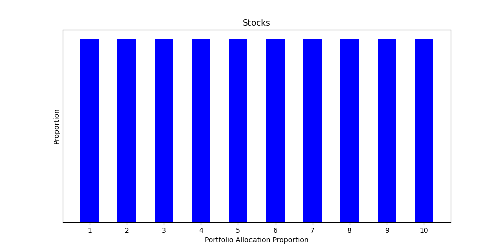
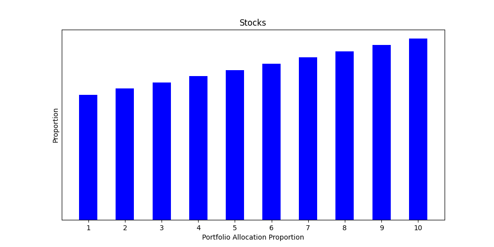

Stocks Portfolio Complexity Analysis
====================================

The COVID-19 pandemic has led to many unexpected situations. With that, the obligatory reference to the "current situation" and "new normal" is done. Now, I can now come to the point. A few months ago, I accidentally created an opportunity to put together my three favourite subjects: finance, mathematics and programming.

## The finance component: stocks portfolio

If you're into stock market investing, you would have likely heard the following standard advice to reduce "complexity" of your portfolio. This advice resonates well with me as I always prefer simplicity over complexity and preach so at every opportunity.

Portfolio complexity increases in the following two ways:
* **Investing in "too many" stocks**: Having more stocks in the portfolio means spending more effort and time to track those stocks, related news, market movements, performance, decision to accumulate/hold/sell, etc.
* **Investing "insignificant" proportions in any stock**: Insignificant proportion of investment in a stock will not meaningfully contribute to your returns, while increasing your work.

However, the financial advisors (and even more so, the pandemic-induced self-declared experts) use the term "complexity" vaguely. Requests for a more precise measure of complexity are met with handwaving or irrelevant quotes from other experts. Hence, I took the matter into my own hands and set out to answer the question:

> How do you measure the complexity of a stocks portfolio?

## The mathematics component: defining a measure of complexity

There are two factors to complexity, number of stocks and the relative proportion of investment. While they are not entirely independent, they are also not completely correlated. Defining a single number as a measure is useful because it enables easy comparison. Comparing a measure that consists of two or more numbers becomes ... uhm, _complex_, if not impossible.

The measure should be a single number that encompasses both aspects of the portfolio complexity. Counting only the number of stocks is clearly insufficient as it doesn't account for the dispersion of proportional investments. The well-known statistical measure standard deviation doesn't account for the number of stocks.

Some combination of these two measures, such as multiplying them is also unreliable. For example, the standard deviation is 0 for portfolios with equal proportional allocation, regardless of number of stocks.

This was the starting point of my intuition. I wondered if the x-axis could be "tilted" so that the standard deviation is not 0 any more. This "tilting" is also useful to account for the number of stocks because with more stocks, you go higher up on the "slope".

However, for the measure to be reliable, it should not vary by the order of the stocks proportion. This is easily solved by sorting the numbers before the "tilting". The numbers can be sorted in ascending order so that increase in number of stocks makes greater contribution to the complexity.

Now, I realized that in reality, the complexity increases exponentially, rather than linearly, with the number of stocks. The "tilting" should also reflect this. The standard deviation is not required any more, even though that was the start of my intuition.

The proportions can be assigned "weights" that increase exponentially. These weighted proportions can be added to obtain the complexity measure. I arrived at e0.1 x as a suitable weighing factor through experimentation.

## The programming component: python!

I learned python a few years ago and loved it. Unfortunately, I didn't create enough opportunities to use it outside of tutorials and toy examples. Here I found an excellent opportunity to rejuvenate my python programming skills. Despite my python rustiness, it took me only a few minutes to compute the complexity for my portfolio on that day.

Then I decided to make the project more interesting by plotting the complexity of my historical portfolio against time. All I had to do was to obtain my historical portfolio data and run my code over it in a loop. It would take only about an hour, maybe two. [Or so I thought.](https://tvtropes.org/pmwiki/pmwiki.php/Main/TemptingFate) Over two months later, the project is only partially completed (using some workarounds) and [a lot more work still remains to be done](https://tvtropes.org/pmwiki/pmwiki.php/Main/SequelEscalation).

This is where the story of my "small python script accidentally exploded into hobby project" begins. I initially chose the boring name `stocks_complexity.py` for the small script. When I realized it had exploded into a _project_, I decided it needed a more interesting name, and thus, the project became `multibeggar`.

The story continues in the next part. (when I find time to write it :stuck_out_tongue:) 
